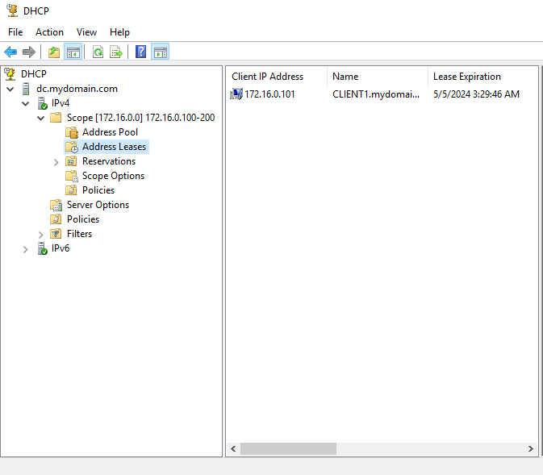

# Active Directory HomeLab Project

## Table of Contents

1. [Project Description](#project-description)
2. [Configuration](#configuration)
3. [Skills Learned](#skills-learned)
4. [Additional Information](#additional-information)

## Project Description

This project was created to expand knowledge about managing and configuring Windows Server and services related to Active Directory. By utilizing materials provided on the Pasja Informatyki YouTube channel and the Josh Madakor channel, I built my own HomeLab based on VirtualBox. Establishing a HomeLab based on Windows Server allowed me to practically familiarize myself with various aspects of network management and services provided by Active Directory.

## Configuration

### Initial Setup - Assumptions

Using the VirtualBox application, I created two virtual machines:
1. Windows Server 2019
2. Windows 10 - as a client

The Domain Controller in my HomeLab was the Windows Server, and the client was a computer (virtual machine) with Windows 10.

I utilized the topology provided by Josh Madakor:

### Skills Learned

During the implementation of this project, I learned:

- Basic Windows Server management.
- Installation and configuration of Active Directory.
- Configuration of remote access to servers.
- Remote installation of software on computers in the network.
- Configuration of roaming profiles.
- Management of user accounts and groups.

- Utilization of Group Policy for environment management.

- Configuration of DHCP and NAT services.

## Additional Information

- Pasja Informatyki YouTube Channel: [link](https://www.youtube.com/@Pasjainformatyki)
- Josh Madakor YouTube Channel: [link](https://www.youtube.com/@JoshMadakor)
